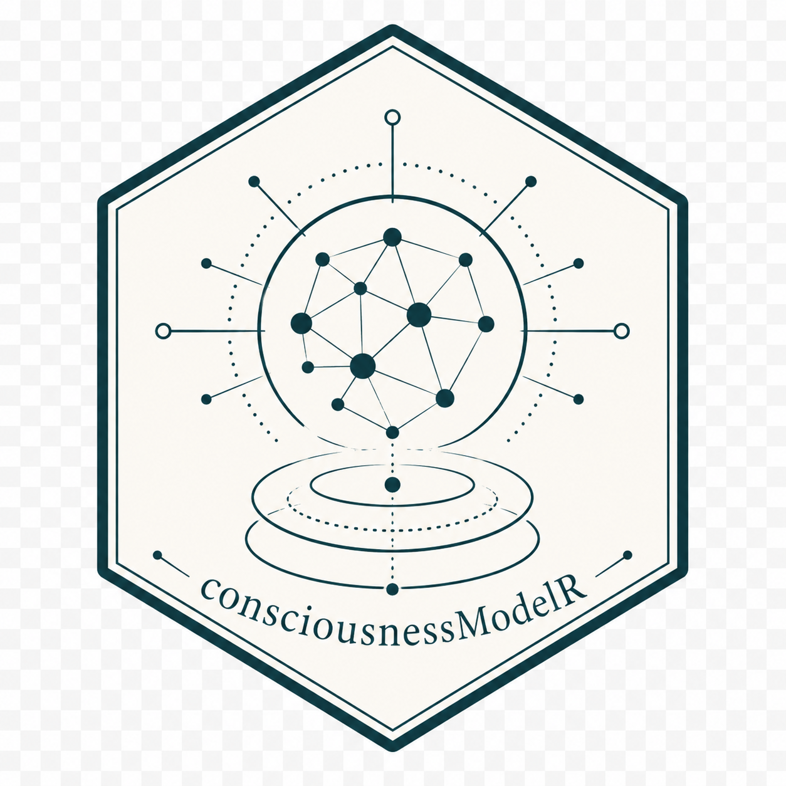

# consciousnessModelR

[](https://www.r-project.org/)
[](LICENSE)
[](https://noushinn.github.io/consciousnessModelR/)
<!-- badges: start -->
[](https://doi.org/10.5281/zenodo.20766470)
<!-- badges: end -->
[](https://github.com/NoushinN/consciousnessModelR)

**consciousnessModelR** is an educational R package for simulating, visualizing, and explaining simplified computational models inspired by consciousness theories.

The package combines R functions, code tutorials, and a theory guide to help learners explore how different theories describe attention, conscious access, global broadcast, information integration, and threshold-like awareness.

## Main features

The package provides educational toy simulations for:

- Global Workspace Theory
- Attention and competition models
- Broadcast dynamics
- Information integration
- Threshold-based awareness-like processing

## Important note

This package **does not detect, measure, or create real consciousness**. The models are simplified educational abstractions for teaching, science communication, conceptual exploration, and portfolio development.

## Installation

```r
if (!requireNamespace("remotes", quietly = TRUE)) {
  install.packages("remotes")
}

remotes::install_github("NoushinN/consciousnessModelR")
```

## Quick example

```r
library(consciousnessModelR)

sim <- simulate_global_workspace(
  n_processes = 8,
  steps = 100,
  seed = 123
)

head(sim)

plot_consciousness_sim(
  sim,
  x = "step",
  y = "activation",
  group = "process"
)
```

## Package structure

The package website includes three main sections:

| Section | Purpose |
|---|---|
| **Reference** | Formal documentation for each R function |
| **Code Tutorials** | Step-by-step examples showing how to run and interpret simulations |
| **Theory Guide** | Conceptual chapters explaining the consciousness theories behind the models |

## Code tutorials

The code tutorials explain how to use the package functions:

1. Getting Started  
2. Global Workspace Simulation  
3. Attention Competition  
4. Broadcast Network  
5. Information Integration  
6. Threshold Models  
7. Comparing Theories  
8. Limitations and Ethics  

## Theory guide

The theory guide provides academic background for the models:

1. What Is Consciousness?  
2. Global Workspace Theory  
3. Attention and Competition  
4. Information Integration  
5. Broadcast and Conscious Access  
6. Threshold Models  
7. Comparing Consciousness Theories  
8. Limitations and Responsible Use  

## Core functions

| Function | Purpose |
|---|---|
| `simulate_global_workspace()` | Simulates competition among processes and possible global broadcast |
| `attention_competition_model()` | Simulates priority-based selection among competing signals |
| `broadcast_network()` | Simulates how selected information spreads across a network |
| `simulate_information_integration()` | Simulates a simplified integration and differentiation score |
| `consciousness_threshold()` | Applies a simplified awareness-like threshold to activation values |
| `plot_consciousness_sim()` | Visualizes simulation outputs |

## Documentation

The full package website is available here:

<https://noushinn.github.io/consciousnessModelR/>

## Suggested use

This package may be useful for:

- teaching consciousness theories
- introducing computational modeling
- comparing theoretical assumptions
- developing educational simulations
- building an academic or technical portfolio

## License

MIT License

## Citation
If referencing this project, please cite: Nabavi, N. *consciousnessModelR: An Educational R Package for Simulating Simplified Computational Models Inspired by Consciousness Theories*
[](https://doi.org/10.5281/zenodo.20766470)