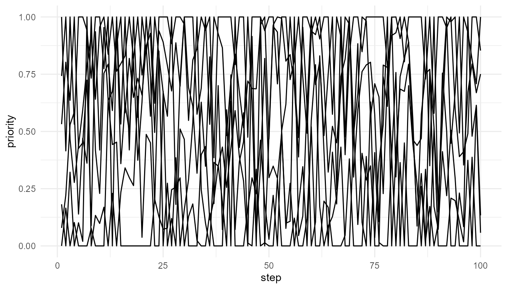

# Attention Competition Model

``` r
library(consciousnessModelR)
```

## Theory background

Attention can be understood as a selection process.

Signals may compete based on salience, novelty, goal relevance, and
noise.

## Run the model

``` r
attn <- attention_competition_model(n_signals = 6, steps = 100, weights = c(0.4, 0.3, 0.3), seed = 22)
head(attn)
#>   step signal  salience   novelty goal_relevance   priority selected
#> 1    1     S1 0.3042768 0.6151681      0.4736784 0.18182488    FALSE
#> 2    1     S2 0.4747389 0.7391713      0.8581398 0.53170075    FALSE
#> 3    1     S3 0.9935258 0.4172400      0.4353518 0.74199199    FALSE
#> 4    1     S4 0.5206539 0.3726250      0.0822696 0.00000000    FALSE
#> 5    1     S5 0.8432310 0.9684221      0.4207948 1.00000000     TRUE
#> 6    1     S6 0.7233145 0.6074081      0.1749127 0.07868366    FALSE
#>   selected_signal
#> 1              S5
#> 2              S5
#> 3              S5
#> 4              S5
#> 5              S5
#> 6              S5
```

## Which signals were selected?

``` r
table(attn$selected_signal)
#> 
#>  S1  S2  S3  S4  S5  S6 
#>   6  66 288   6 192  42
```

## Plot priorities

``` r
plot_consciousness_sim(attn, x = "step", y = "priority", group = "signal")
```



## Interpretation

Changing weights changes the basis of competition. A salience-dominated
system responds strongly to intense signals, while a goal-dominated
system prioritizes task relevance.
