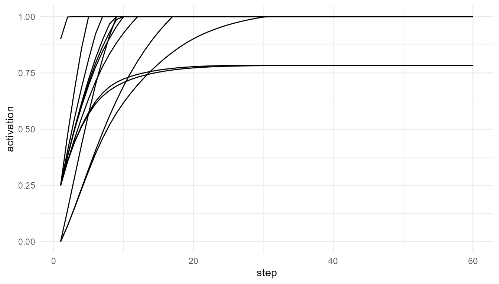

# Broadcast Network Simulation

``` r
library(consciousnessModelR)
```

## Theory background

In global workspace models, a selected signal becomes widely available
to multiple systems.

[`broadcast_network()`](https://noushinn.github.io/consciousnessModelR/reference/broadcast_network.md)
represents this idea using a simple network.

## Run the model

``` r
net <- broadcast_network(n_nodes = 12, steps = 60, source_node = 1, connection_probability = 0.25, seed = 7)
head(net$time_series)
#>   step node activation source_node
#> 1    1   N1       0.90          N1
#> 2    1   N2       0.25          N1
#> 3    1   N3       0.25          N1
#> 4    1   N4       0.00          N1
#> 5    1   N5       0.25          N1
#> 6    1   N6       0.25          N1
```

## View network structure

``` r
net$adjacency_matrix
#>       [,1] [,2] [,3] [,4] [,5] [,6] [,7] [,8] [,9] [,10] [,11] [,12]
#>  [1,]    0    1    1    0    1    1    1    1    0     1     0     1
#>  [2,]    1    0    0    1    1    0    1    0    0     0     1     1
#>  [3,]    1    0    0    1    1    1    0    0    1     0     0     1
#>  [4,]    0    1    1    0    1    0    1    1    1     0     0     1
#>  [5,]    1    1    1    1    0    0    0    0    0     0     0     1
#>  [6,]    1    0    1    0    0    0    0    0    0     0     0     1
#>  [7,]    1    1    0    1    0    0    0    1    1     1     1     1
#>  [8,]    1    0    0    1    0    0    1    0    1     0     0     1
#>  [9,]    0    0    1    1    0    0    1    1    0     0     1     0
#> [10,]    1    0    0    0    0    0    1    0    0     0     0     1
#> [11,]    0    1    0    0    0    0    1    0    1     0     0     1
#> [12,]    1    1    1    1    1    1    1    1    0     1     1     0
```

## Plot activation spread

``` r
plot_consciousness_sim(net$time_series, x = "step", y = "activation", group = "node")
```



## Interpretation

More connected networks tend to spread activation more broadly. Sparse
networks may isolate activation in a small part of the system.
