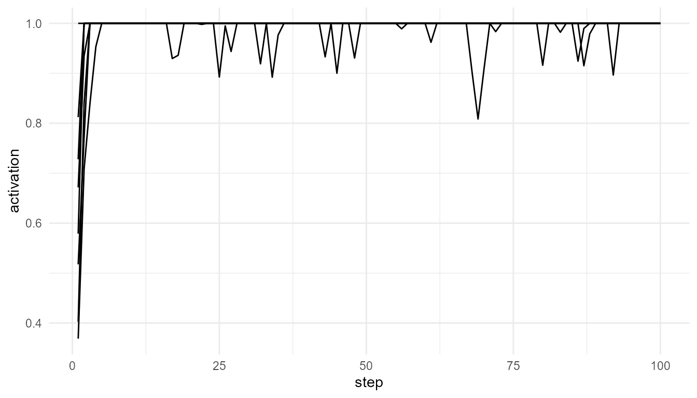
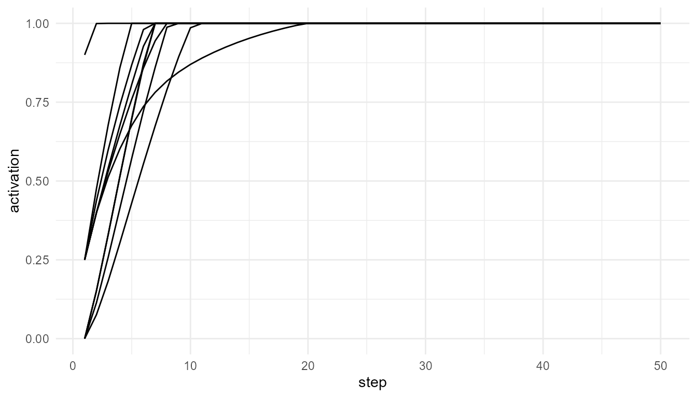
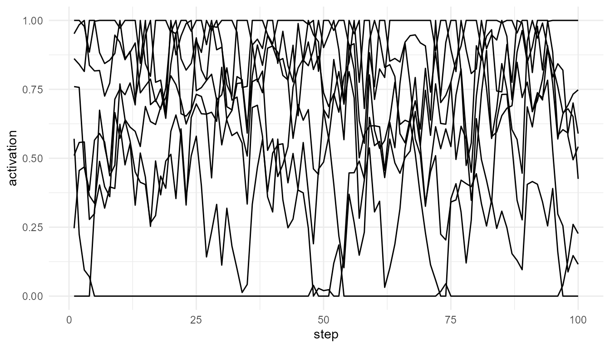

# Comparing Consciousness Theories with Toy Models

``` r
library(consciousnessModelR)
```

## Purpose

This article compares how simplified simulations can represent different
theoretical approaches in consciousness studies. The goal is not to
decide which theory is correct. Instead, the goal is to clarify what
each theory emphasizes, what kind of mechanism it proposes, and how
those mechanisms can be translated into educational toy models.

The central question is:

> How can computational models help us compare theories of consciousness
> without reducing consciousness to a single number or mechanism?

`consciousnessModelR` takes a modular approach. It separates attention,
competition, broadcast, integration, and threshold crossing into
different functions. This allows learners to examine each theoretical
component independently before considering how the components may
interact.

## Why compare theories with toy models?

Theories of consciousness often operate at different explanatory levels.
Some focus on cognitive access, some on neural architecture, some on
information structure, and others on subjective experience. Because
these theories do not always explain the same thing, direct comparison
can be difficult.

Toy models are useful because they force theoretical ideas to become
explicit. A theory that says consciousness depends on “global
availability” must clarify what availability means. A theory that
emphasizes “integration” must clarify what is being integrated. A theory
that refers to “thresholds” must specify what crosses the threshold and
what changes afterward.

A toy model is therefore not a substitute for a theory. It is a tool for
examining the structure of a theory.

## Theories and package functions

| Function | Inspired by | Main concept | What it helps illustrate |
|----|----|----|----|
| [`simulate_global_workspace()`](https://noushinn.github.io/consciousnessModelR/reference/simulate_global_workspace.md) | Global Workspace Theory | Competition and global access | How one process may dominate and become globally available |
| [`attention_competition_model()`](https://noushinn.github.io/consciousnessModelR/reference/attention_competition_model.md) | Attention and selection models | Priority-based selection | How salience, novelty, and goals shape attentional priority |
| [`broadcast_network()`](https://noushinn.github.io/consciousnessModelR/reference/broadcast_network.md) | Broadcast/access theories | Network-wide availability | How selected information spreads across a system |
| [`simulate_information_integration()`](https://noushinn.github.io/consciousnessModelR/reference/simulate_information_integration.md) | Information integration theories | Integration and differentiation | How system structure may combine unity and diversity |
| [`consciousness_threshold()`](https://noushinn.github.io/consciousnessModelR/reference/consciousness_threshold.md) | Threshold/access models | Activation crossing a boundary | How theoretical assumptions define access-like events |

This structure is intentionally pluralistic. The package does not assume
that one theory fully explains consciousness. Instead, it allows
learners to compare what different theories treat as important.

## Access, integration, and experience

A major challenge in consciousness studies is that different theories
may explain different aspects of consciousness.

Global Workspace Theory emphasizes **access**. It asks how information
becomes available for report, reasoning, memory, and action (Baars 1988;
Dehaene 2014).

Information integration approaches emphasize **system organization**.
They ask whether a system has both unity and differentiation, and
whether the whole has informational properties not reducible to
independent parts (Tononi 2004; Oizumi, Albantakis, and Tononi 2014).

Attention models emphasize **selection**. They ask why some signals
receive priority while others remain in the background (Desimone and
Duncan 1995; Posner 1994).

Threshold models emphasize **transition**. They ask when weak or local
processing becomes stable, reportable, or globally available (Sandberg
et al. 2010).

These are related questions, but they are not identical. A system could
select information without broadcasting it. It could broadcast
information without satisfying a strong integration criterion. It could
cross a threshold without explaining subjective experience. These
distinctions are central to responsible theory comparison.

## Model 1: Global workspace and access

Global Workspace Theory describes consciousness as system-wide
availability. Many processes operate locally, but only some information
becomes globally accessible.

``` r
gw <- simulate_global_workspace(
  n_processes = 8,
  steps = 100,
  ignition_threshold = 0.75,
  seed = 1
)

head(gw)
#>   step process activation winner is_winner broadcast ignited
#> 1    1      P1  0.5175416     P7     FALSE         0    TRUE
#> 2    1      P2  0.4026213     P7     FALSE         0    TRUE
#> 3    1      P3  0.7278461     P7     FALSE         0    TRUE
#> 4    1      P4  0.8121581     P7     FALSE         0    TRUE
#> 5    1      P5  0.3688088     P7     FALSE         0    TRUE
#> 6    1      P6  0.5790204     P7     FALSE         0    TRUE
```

``` r
plot_consciousness_sim(
  gw,
  x = "step",
  y = "activation",
  group = "process"
)
```



## Interpreting the global workspace model

This model asks whether a process can dominate competition and cross an
ignition threshold. It is useful for representing the transition from
local activity to global availability.

The key theoretical assumption is that conscious access depends on more
than activation alone. A signal must become available to a wider system.

This model therefore emphasizes:

- competition among processes;
- selection of a winning process;
- ignition or threshold crossing;
- global availability.

It does not explain subjective experience. It models access-like
processing.

## Model 2: Attention and selection

Attention models focus on priority. A system cannot process all signals
equally, so some signals are selected for enhanced processing.

``` r
attn <- attention_competition_model(
  n_signals = 6,
  steps = 100,
  weights = c(0.4, 0.3, 0.3),
  seed = 1
)

head(attn)
#>   step signal  salience    novelty goal_relevance  priority selected
#> 1    1     S1 0.2655087 0.94467527      0.6870228 0.6251114    FALSE
#> 2    1     S2 0.3721239 0.66079779      0.3841037 0.6955436    FALSE
#> 3    1     S3 0.5728534 0.62911404      0.7698414 0.8038564    FALSE
#> 4    1     S4 0.9082078 0.06178627      0.4976992 0.4849447    FALSE
#> 5    1     S5 0.2016819 0.20597457      0.7176185 0.0000000    FALSE
#> 6    1     S6 0.8983897 0.17655675      0.9919061 1.0000000     TRUE
#>   selected_signal
#> 1              S6
#> 2              S6
#> 3              S6
#> 4              S6
#> 5              S6
#> 6              S6
```

``` r
table(attn$selected_signal)
#> 
#>  S1  S3  S4  S6 
#>  24  60 114 402
```

## Interpreting the attention model

The attention model asks which signal receives priority. Selection
depends on salience, novelty, goal relevance, and noise.

This model is important because attention often shapes conscious access,
but attention is not identical to consciousness. A selected signal may
become a candidate for access, but it may not necessarily become
conscious.

This model therefore emphasizes:

- limited processing capacity;
- competition among signals;
- salience, novelty, and goals;
- priority-based selection.

It does not model global availability or subjective experience by
itself.

## Model 3: Broadcast and availability

Broadcast models focus on what happens after a signal is selected. A
signal may remain local, or it may spread across a network and become
available to multiple systems.

``` r
net <- broadcast_network(
  n_nodes = 10,
  steps = 50,
  connection_probability = 0.30,
  seed = 1
)

head(net$time_series)
#>   step node activation source_node
#> 1    1   N1       0.90          N1
#> 2    1   N2       0.00          N1
#> 3    1   N3       0.25          N1
#> 4    1   N4       0.25          N1
#> 5    1   N5       0.25          N1
#> 6    1   N6       0.25          N1
```

``` r
plot_consciousness_sim(
  net$time_series,
  x = "step",
  y = "activation",
  group = "node"
)
```



## Interpreting the broadcast model

This model asks how widely information becomes available. A densely
connected network may allow activation to spread more broadly. A sparse
network may keep information relatively local.

Broadcast is theoretically important because access-oriented theories
often treat consciousness as a change in availability. Information
becomes more functionally powerful when it can influence memory,
reasoning, report, and action.

This model therefore emphasizes:

- network architecture;
- spread of activation;
- local versus distributed availability;
- functional access.

It does not determine whether broadcast is sufficient for consciousness.

## Model 4: Information integration

Information integration approaches ask a different kind of question.
They are less focused on report and more focused on system organization.

``` r
info <- simulate_information_integration(
  n_components = 8,
  steps = 100,
  connection_probability = 0.30,
  seed = 1
)

info$summary
#>   mean_connectivity shared_information differentiation integration_score
#> 1           0.40625          0.1653532       0.3432453        0.02305742
```

``` r
plot_consciousness_sim(
  info$time_series,
  x = "step",
  y = "activation",
  group = "component"
)
```



## Interpreting the integration model

The package function does not compute formal phi. Instead, it provides a
simplified educational proxy based on connectivity, shared activity, and
differentiation.

This model asks whether a system has both unity and diversity. A
completely disconnected system lacks integration. A completely uniform
system may lack differentiation. The theoretical interest lies in the
balance between the two.

This model therefore emphasizes:

- system-level organization;
- connectivity;
- shared activity;
- differentiation;
- integration as a structural property.

It does not model reportability or global broadcast directly.

## Model 5: Threshold-based access

Threshold models ask when continuous activation should be classified as
access-like.

``` r
thresholded <- consciousness_threshold(
  gw,
  activation_col = "activation",
  threshold = 0.70
)

head(thresholded)
#>   step process activation winner is_winner broadcast ignited threshold
#> 1    1      P1  0.5175416     P7     FALSE         0    TRUE       0.7
#> 2    1      P2  0.4026213     P7     FALSE         0    TRUE       0.7
#> 3    1      P3  0.7278461     P7     FALSE         0    TRUE       0.7
#> 4    1      P4  0.8121581     P7     FALSE         0    TRUE       0.7
#> 5    1      P5  0.3688088     P7     FALSE         0    TRUE       0.7
#> 6    1      P6  0.5790204     P7     FALSE         0    TRUE       0.7
#>   above_threshold threshold_distance
#> 1           FALSE        -0.18245842
#> 2           FALSE        -0.29737870
#> 3            TRUE         0.02784607
#> 4            TRUE         0.11215808
#> 5           FALSE        -0.33119124
#> 6           FALSE        -0.12097958
```

``` r
table(thresholded$above_threshold)
#> 
#> FALSE  TRUE 
#>     5   795
```

## Interpreting the threshold model

Thresholding is useful because many theories assume a transition from
weak processing to stronger access-like processing. However, the
threshold is a modeling assumption.

A low threshold makes access-like events common. A high threshold makes
them rare. This shows that theoretical conclusions can depend on how
access is defined.

This model therefore emphasizes:

- classification of activation values;
- access boundaries;
- above-threshold and below-threshold processing;
- sensitivity to assumptions.

It does not reveal the true boundary of consciousness.

## Comparing theoretical commitments

The models differ in what they treat as central.

| Theory family | Central question | Package representation |
|----|----|----|
| Attention models | Which signal is prioritized? | [`attention_competition_model()`](https://noushinn.github.io/consciousnessModelR/reference/attention_competition_model.md) |
| Global workspace models | Which signal becomes globally available? | [`simulate_global_workspace()`](https://noushinn.github.io/consciousnessModelR/reference/simulate_global_workspace.md) |
| Broadcast models | How widely does selected information spread? | [`broadcast_network()`](https://noushinn.github.io/consciousnessModelR/reference/broadcast_network.md) |
| Integration models | How unified and differentiated is the system? | [`simulate_information_integration()`](https://noushinn.github.io/consciousnessModelR/reference/simulate_information_integration.md) |
| Threshold models | When does activation count as access-like? | [`consciousness_threshold()`](https://noushinn.github.io/consciousnessModelR/reference/consciousness_threshold.md) |

These questions can be combined, but they should not be collapsed into
one another. A mature theory of consciousness may need to explain
attention, access, integration, reportability, and subjective experience
together.

## A simple combined workflow

The following workflow shows how the functions can be used together
conceptually.

``` r
attn <- attention_competition_model(
  n_signals = 6,
  steps = 50,
  seed = 12
)

gw <- simulate_global_workspace(
  n_processes = 6,
  steps = 50,
  ignition_threshold = 0.75,
  seed = 12
)

gw_thresholded <- consciousness_threshold(
  gw,
  activation_col = "activation",
  threshold = 0.75
)

net <- broadcast_network(
  n_nodes = 8,
  steps = 50,
  seed = 12
)

info <- simulate_information_integration(
  n_components = 8,
  steps = 50,
  seed = 12
)

list(
  selected_attention_signals = table(attn$selected_signal),
  global_workspace_ignition = table(gw$ignited),
  threshold_crossings = table(gw_thresholded$above_threshold),
  integration_summary = info$summary
)
#> $selected_attention_signals
#> 
#>  S2  S3  S6 
#> 126 162  12 
#> 
#> $global_workspace_ignition
#> 
#> TRUE 
#>  300 
#> 
#> $threshold_crossings
#> 
#> FALSE  TRUE 
#>    17   283 
#> 
#> $integration_summary
#>   mean_connectivity shared_information differentiation integration_score
#> 1           0.40625          0.1907601       0.3626935        0.02810739
```

## Interpreting the combined workflow

This workflow should not be interpreted as a complete theory of
consciousness. Rather, it shows how different theoretical components can
be placed side by side.

The attention model asks what is prioritized. The global workspace model
asks what becomes access-like. The broadcast model asks how information
spreads. The integration model asks what kind of system organization is
present. The threshold model asks how activation is classified.

Together, they form a teaching framework for comparing assumptions.

## What all toy models leave out

All the models in this package are intentionally simplified. They leave
out many important features of real consciousness, including:

- subjective experience;
- embodiment;
- emotion;
- memory in detail;
- self-awareness;
- metacognition;
- biological neural dynamics;
- developmental history;
- social and linguistic context.

This limitation is not a weakness if it is stated clearly. Toy models
are not meant to reproduce the full phenomenon. They are meant to make
theoretical assumptions easier to inspect.

## Could artificial systems satisfy model criteria?

One important philosophical question is whether an artificial system
could satisfy some of these model criteria without being conscious.

For example, an artificial system might show attention-like selection,
global broadcast, threshold crossing, or high integration. Would that be
enough for consciousness? Different theories answer this question
differently.

Global workspace theorists may emphasize functional access. Information
integration theorists may emphasize system structure. Philosophers
concerned with the hard problem may argue that functional organization
still does not explain subjective experience (Chalmers 1996).

The package does not resolve this debate. It provides tools for
examining why the debate is difficult.

## Educational use

This article can support several classroom or self-study activities:

1.  Run each model with default settings.
2.  Change one parameter at a time.
3.  Ask what theoretical assumption the parameter represents.
4.  Compare how the output changes.
5.  Discuss what the model captures and what it omits.

This approach helps students move from memorizing theories to actively
analyzing them.

## Reflection questions

1.  Does attention imply consciousness?
2.  Can information be globally broadcast without being consciously
    experienced?
3.  Can information be integrated without being reportable?
4.  Does threshold crossing represent awareness or only access?
5.  Could an artificial system satisfy functional criteria without
    subjective experience?
6.  Are access consciousness and phenomenal consciousness explained by
    the same mechanisms?
7.  Which theory is best represented by toy simulation, and which parts
    resist simulation?
8.  What would need to be added to make the models more realistic?

## Key takeaway

Toy models do not solve the problem of consciousness. Their value is
conceptual. They make assumptions visible, allow theories to be
compared, and help learners understand the difference between attention,
access, broadcast, integration, and subjective experience.

`consciousnessModelR` should therefore be understood as an educational
modeling framework. It supports careful comparison of theories while
preserving the distinction between simulated mechanisms and
consciousness itself.

## References

Baars, Bernard J. 1988. *A Cognitive Theory of Consciousness*. Cambridge
University Press.

Chalmers, David J. 1996. *The Conscious Mind*. Oxford University Press.

Dehaene, Stanislas. 2014. *Consciousness and the Brain*. Viking.

Desimone, Robert, and John Duncan. 1995. “Neural Mechanisms of Selective
Visual Attention.” *Annual Review of Neuroscience* 18: 193–222.

Oizumi, Masafumi, Larissa Albantakis, and Giulio Tononi. 2014. “From the
Phenomenology to the Mechanisms of Consciousness: Integrated Information
Theory 3.0.” *PLoS Computational Biology* 10 (5): e1003588.

Posner, Michael I. 1994. “Attention: The Mechanisms of Consciousness.”
*Proceedings of the National Academy of Sciences* 91 (16): 7398–7403.

Sandberg, Kristian, Bert Timmermans, Morten Overgaard, and Axel
Cleeremans. 2010. “Measuring Consciousness: Is One Measure Better Than
the Other?” *Consciousness and Cognition* 19 (4): 1069–78.

Tononi, Giulio. 2004. “An Information Integration Theory of
Consciousness.” *BMC Neuroscience* 5 (42).
