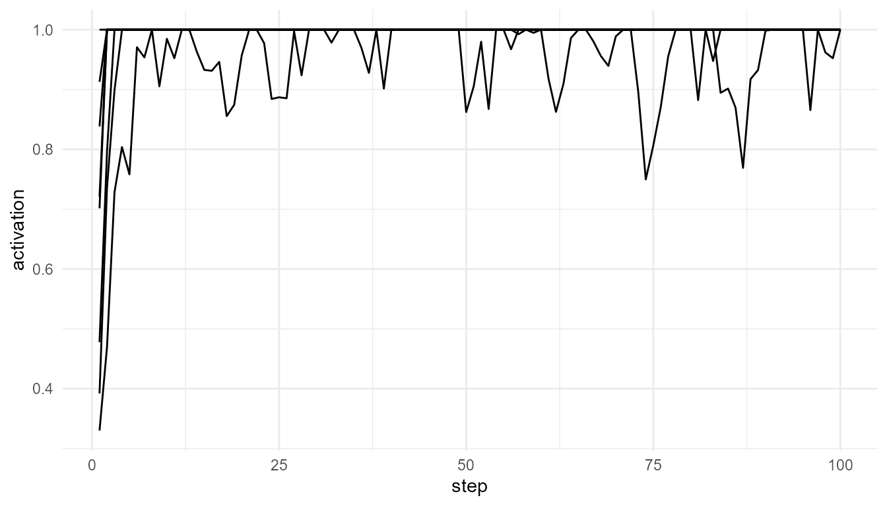

# Getting Started with consciousnessModelR

``` r
library(consciousnessModelR)
```

## Overview

`consciousnessModelR` provides simplified simulations for teaching major
ideas in consciousness studies.

The package focuses on educational clarity. It does not attempt to
measure or produce consciousness.

The central learning question is:

> How can different theories of consciousness be represented as simple
> computational models?

## Main ideas

The package includes models inspired by:

- Global Workspace Theory
- Attention competition
- Broadcast dynamics
- Information integration
- Threshold models of awareness-like processing

## A first simulation

``` r
sim <- simulate_global_workspace(n_processes = 8, steps = 100, seed = 123)
head(sim)
#>   step process activation winner is_winner broadcast ignited
#> 1    1      P1  0.3920908     P8     FALSE         0    TRUE
#> 2    1      P2  0.7014752     P8     FALSE         0    TRUE
#> 3    1      P3  0.7208877     P8     FALSE         0    TRUE
#> 4    1      P4  0.8383253     P8     FALSE         0    TRUE
#> 5    1      P5  0.9127688     P8     FALSE         0    TRUE
#> 6    1      P6  0.3300235     P8     FALSE         0    TRUE
```

## Plot activation through time

``` r
plot_consciousness_sim(sim, x = "step", y = "activation", group = "process")
```



## Apply a threshold

``` r
thresholded <- consciousness_threshold(sim, activation_col = "activation", threshold = 0.7)
head(thresholded)
#>   step process activation winner is_winner broadcast ignited threshold
#> 1    1      P1  0.3920908     P8     FALSE         0    TRUE       0.7
#> 2    1      P2  0.7014752     P8     FALSE         0    TRUE       0.7
#> 3    1      P3  0.7208877     P8     FALSE         0    TRUE       0.7
#> 4    1      P4  0.8383253     P8     FALSE         0    TRUE       0.7
#> 5    1      P5  0.9127688     P8     FALSE         0    TRUE       0.7
#> 6    1      P6  0.3300235     P8     FALSE         0    TRUE       0.7
#>   above_threshold threshold_distance
#> 1           FALSE       -0.307909171
#> 2            TRUE        0.001475242
#> 3            TRUE        0.020887668
#> 4            TRUE        0.138325290
#> 5            TRUE        0.212768817
#> 6           FALSE       -0.369976484
```

## Interpretation

In this toy model, several processes compete for access. A process with
sufficiently high activation may cross a threshold and become globally
broadcast.

This is an educational representation of one idea from Global Workspace
Theory, not a model of real subjective experience.

## Suggested reading

Global Workspace Theory was developed by Baars and later expanded in
cognitive neuroscience by Dehaene and colleagues (Baars 1988; Dehaene
and Changeux 2011; Dehaene 2014).

Baars, Bernard J. 1988. *A Cognitive Theory of Consciousness*. Cambridge
University Press.

Dehaene, Stanislas. 2014. *Consciousness and the Brain*. Viking.

Dehaene, Stanislas, and Jean-Pierre Changeux. 2011. “Experimental and
Theoretical Approaches to Conscious Processing.” *Neuron* 70 (2):
200–227.
