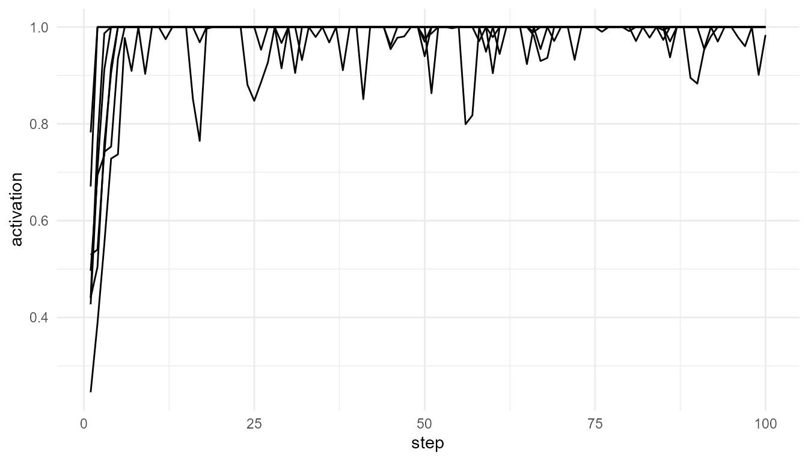

# Global Workspace Theory

``` r
library(consciousnessModelR)
```

## Purpose

This article explains the theoretical background behind
[`simulate_global_workspace()`](https://noushinn.github.io/consciousnessModelR/reference/simulate_global_workspace.md).
Global Workspace Theory, originally developed by Baars, describes
consciousness as a form of system-wide availability: information becomes
conscious when it is made accessible to a broad set of specialized
cognitive systems (Baars 1988, 2002).

In this framework, consciousness is not treated as a separate substance
or as a mysterious inner object. Instead, it is understood functionally:
conscious information is information that can be used by multiple
systems, including memory, reasoning, report, planning, and action.

The goal of this article is to explain how that theoretical idea is
translated into a simplified educational simulation.

## The core idea of Global Workspace Theory

Global Workspace Theory begins from the observation that cognition
appears to involve many specialized processes operating in parallel.
Visual processing, language, memory, emotion, motor planning, and
attention can all be treated as partially specialized systems. Most of
their activity does not become conscious.

According to the theory, consciousness occurs when some information
becomes globally available across this wider system. A stimulus,
thought, or representation may begin as local processing, but if it
becomes sufficiently strong, stable, or relevant, it may enter a global
workspace.

Once information enters this workspace, it can influence many other
processes. It may become reportable, remembered, used in
decision-making, or integrated into ongoing planning.

In simplified terms, the theory contains three major stages:

1.  **Local processing**: many specialized processes operate in
    parallel.
2.  **Competition for access**: signals compete for entry into the
    global workspace.
3.  **Global broadcast**: the selected signal becomes widely available
    to other systems.

This architecture is often compared to a theatre. Many activities happen
backstage, but only selected information appears “on stage” and becomes
available to the wider audience of cognitive systems (Baars 1988).

## From cognitive theory to neuroscience

Later neuroscientific versions of the theory, especially the Global
Neuronal Workspace framework, connect global access to large-scale
neural activity (Dehaene and Naccache 2001; Dehaene and Changeux 2011).
In this view, conscious access is associated with the stabilization and
amplification of information across distributed brain networks.

A key concept in this literature is **ignition**. Ignition refers to a
transition in which a signal moves from weak or local processing to a
more stable, widespread, and reportable state. This transition is often
described as non-linear: small increases in stimulus strength or
attention may produce a sudden shift in access.

In `consciousnessModelR`, ignition is represented in simplified form by
the `ignition_threshold` argument. A process may have activation, but it
is only treated as globally available when it crosses this threshold.

## Relation to the package

The function
[`simulate_global_workspace()`](https://noushinn.github.io/consciousnessModelR/reference/simulate_global_workspace.md)
represents the logic of Global Workspace Theory using a small set of
competing processes.

Each process has an activation value. At each time step, the model
identifies the process with the highest activation. If that process also
exceeds the ignition threshold, the signal is treated as globally
broadcast.

This gives the model three important components:

| Theoretical concept | Package representation |
|----|----|
| Local processors | Competing simulated processes |
| Signal strength | Activation values |
| Competition | Selection of the highest-activation process |
| Ignition | Crossing the `ignition_threshold` |
| Global access | The `broadcast` output |
| Conscious-access-like event | A process winning competition and crossing threshold |

This is not a neural model. It is a conceptual model that captures the
logic of competition, selection, ignition, and broadcast.

## Basic simulation

The following example simulates eight competing processes over 100 time
steps.

``` r
gw <- simulate_global_workspace(
  n_processes = 8,
  steps = 100,
  noise = 0.10,
  ignition_threshold = 0.75,
  seed = 10
)

head(gw)
#>   step process activation winner is_winner broadcast ignited
#> 1    1      P1  0.4403523     P4     FALSE 0.0000000    TRUE
#> 2    1      P2  0.4271607     P4     FALSE 0.0000000    TRUE
#> 3    1      P3  0.6705875     P4     FALSE 0.0000000    TRUE
#> 4    1      P4  0.7822774     P4      TRUE 0.7822774    TRUE
#> 5    1      P5  0.2454197     P4     FALSE 0.0000000    TRUE
#> 6    1      P6  0.5293545     P4     FALSE 0.0000000    TRUE
```

``` r
plot_consciousness_sim(
  gw,
  x = "step",
  y = "activation",
  group = "process"
)
```



## Inspecting ignition and competition

The `ignited` column indicates whether the winning process crossed the
ignition threshold at each time step.

``` r
table(gw$ignited)
#> 
#> TRUE 
#>  800
```

The `winner` column shows which process had the highest activation at
each time step.

``` r
table(gw$winner)
#> 
#>  P1  P3  P4 
#> 776  16   8
```

These two outputs should be interpreted together. A process can win
competition without igniting. In theoretical terms, this means a signal
may be locally dominant without becoming globally available.

## Conceptual interpretation

The output illustrates a central distinction in Global Workspace Theory:
**local activation is not the same as conscious access**.

A process may be active. It may even be stronger than other competing
processes. However, in this simplified model, global availability
requires something more: the process must both win the competition and
cross the ignition threshold.

This distinction is important because Global Workspace Theory is not
simply a theory of activation. It is a theory of access. Consciousness,
in this model, depends on whether information becomes available to a
wider system.

## Threshold experiment

The ignition threshold is one of the most important parameters in the
model. It represents how difficult it is for a signal to become globally
available.

``` r
low_threshold <- simulate_global_workspace(
  ignition_threshold = 0.50,
  seed = 10
)

high_threshold <- simulate_global_workspace(
  ignition_threshold = 0.90,
  seed = 10
)

table(low_threshold$ignited)
#> 
#> TRUE 
#>  800
table(high_threshold$ignited)
#> 
#> FALSE  TRUE 
#>     8   792
```

## Interpretation of the threshold experiment

A lower threshold makes global access easier. More signals are
classified as ignited. A higher threshold makes global access more
selective. Fewer signals cross the boundary into broadcast.

This experiment illustrates how theoretical assumptions affect model
behavior. If conscious access is assumed to require only modest
activation, then access-like events become common. If conscious access
requires strong, stable activation, then access-like events become rare.

The threshold therefore has both a computational and conceptual meaning.
It is not merely a number in the code; it represents an assumption about
the conditions under which information becomes globally available.

## Noise, stability, and competition

The `noise` argument represents random fluctuation in process
activation. In theoretical terms, this can be understood as variability
in input, uncertainty, or background processing.

``` r
low_noise <- simulate_global_workspace(
  noise = 0.02,
  ignition_threshold = 0.75,
  seed = 10
)

high_noise <- simulate_global_workspace(
  noise = 0.25,
  ignition_threshold = 0.75,
  seed = 10
)

table(low_noise$winner)
#> 
#>  P1  P4 
#> 784  16
table(high_noise$winner)
#> 
#>  P1  P2  P3  P4 
#> 680  80  24  16
```

Low noise tends to produce more stable competition. High noise can make
the winning process less predictable. This is useful for teaching
because it shows that access is shaped not only by signal strength but
also by variability in the system.

## What the model captures

The simulation captures several theoretical features of global workspace
accounts:

- many processes operate in parallel;
- only some information becomes globally available;
- competition influences access;
- threshold crossing represents ignition;
- broadcast represents system-wide availability.

These features make the model useful for teaching the functional logic
of Global Workspace Theory.

## What the model does not capture

The model is intentionally simplified. It does not include:

- detailed brain anatomy;
- sensory systems;
- working memory architecture;
- recurrent cortical processing;
- long-range neural connectivity;
- report behavior;
- subjective experience.

It also does not prove that global broadcast is sufficient for
consciousness. Philosophically, one may still ask whether access,
reportability, or broadcast fully explains phenomenal experience. This
is one reason Global Workspace Theory is often discussed alongside other
approaches, including higher-order theories, recurrent processing
theories, and Integrated Information Theory.

## Relation to other functions

[`simulate_global_workspace()`](https://noushinn.github.io/consciousnessModelR/reference/simulate_global_workspace.md)
works closely with other functions in the package.

| Related function | Relationship to Global Workspace Theory |
|----|----|
| [`attention_competition_model()`](https://noushinn.github.io/consciousnessModelR/reference/attention_competition_model.md) | Models how signals may be prioritized before workspace access |
| [`broadcast_network()`](https://noushinn.github.io/consciousnessModelR/reference/broadcast_network.md) | Models how selected information spreads after access |
| [`consciousness_threshold()`](https://noushinn.github.io/consciousnessModelR/reference/consciousness_threshold.md) | Applies threshold logic to activation values |
| [`plot_consciousness_sim()`](https://noushinn.github.io/consciousnessModelR/reference/plot_consciousness_sim.md) | Visualizes activation, competition, and access-like patterns |

Together, these functions separate several concepts that are often
combined in theory: attention, competition, ignition, broadcast, and
access.

## Educational use

This simulation is useful in teaching because it allows students to
manipulate theoretical assumptions. For example, students can ask:

- What happens when the ignition threshold is low or high?
- Does noise make conscious-access-like events less stable?
- Does one process dominate the workspace?
- How often does winning competition lead to broadcast?
- Is global availability enough to explain consciousness?

These questions help students move from passive reading to active
theoretical exploration.

## Key takeaway

Global Workspace Theory explains consciousness in terms of access and
availability. In this view, information becomes conscious when it is
selected from among competing processes and made available to a wider
cognitive system.

[`simulate_global_workspace()`](https://noushinn.github.io/consciousnessModelR/reference/simulate_global_workspace.md)
represents this idea as a simplified educational model. It does not
simulate subjective experience, but it does help clarify the theoretical
structure of competition, ignition, and broadcast.

## References

Baars, Bernard J. 1988. *A Cognitive Theory of Consciousness*. Cambridge
University Press.

———. 2002. “The Conscious Access Hypothesis: Origins and Recent
Evidence.” *Trends in Cognitive Sciences* 6 (1): 47–52.

Dehaene, Stanislas, and Jean-Pierre Changeux. 2011. “Experimental and
Theoretical Approaches to Conscious Processing.” *Neuron* 70 (2):
200–227.

Dehaene, Stanislas, and Lionel Naccache. 2001. “Towards a Cognitive
Neuroscience of Consciousness: Basic Evidence and a Workspace
Framework.” *Cognition* 79 (1–2): 1–37.
