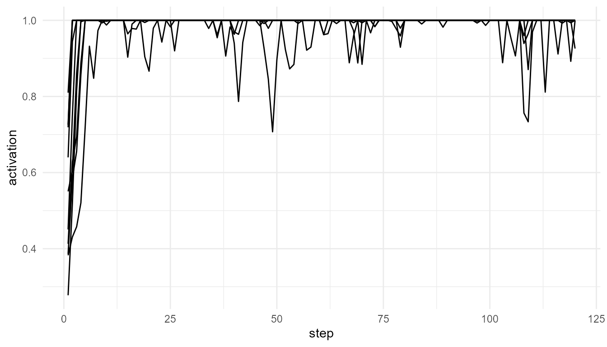

# Global Workspace Simulation

``` r
library(consciousnessModelR)
```

## Theory background

Global Workspace Theory proposes that conscious access involves
information becoming globally available to many specialized systems.

In simple terms:

1.  Many processes operate locally.
2.  They compete for attention.
3.  One signal may become dominant.
4.  The winning signal is broadcast to the wider system.

## Run the simulation

``` r
gw <- simulate_global_workspace(n_processes = 10, steps = 120, noise = 0.1, ignition_threshold = 0.75, seed = 10)
head(gw)
#>   step process activation winner is_winner broadcast ignited
#> 1    1      P1  0.7189298     P4     FALSE 0.0000000    TRUE
#> 2    1      P2  0.5504773     P4     FALSE 0.0000000    TRUE
#> 3    1      P3  0.4504827     P4     FALSE 0.0000000    TRUE
#> 4    1      P4  0.8099538     P4      TRUE 0.8099538    TRUE
#> 5    1      P5  0.3825086     P4     FALSE 0.0000000    TRUE
#> 6    1      P6  0.4128062     P4     FALSE 0.0000000    TRUE
```

## Visualize activation

``` r
plot_consciousness_sim(gw, x = "step", y = "activation", group = "process")
```



## Inspect winning processes

``` r
table(gw$winner)
#> 
#>   P1   P4 
#> 1190   10
```

## Interpretation

A process is treated as entering the workspace when it has the highest
activation and crosses the ignition threshold.

Low thresholds make broadcast easier. High thresholds make broadcast
rarer.
