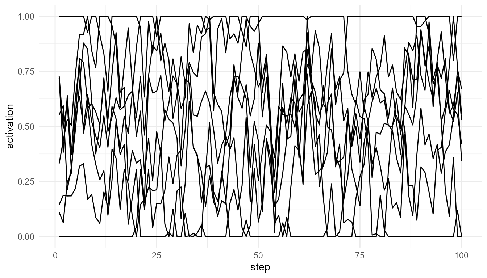

# Information Integration Simulation

``` r
library(consciousnessModelR)
```

## Theory background

Integrated Information Theory argues that consciousness is related to
how much information is integrated within a system.

This package does not compute IIT’s formal phi. Instead, it creates an
educational proxy based on connectivity, shared activity, and
differentiation.

## Run the model

``` r
info <- simulate_information_integration(n_components = 8, steps = 100, connection_probability = 0.3, seed = 42)
info$summary
#>   mean_connectivity shared_information differentiation integration_score
#> 1            0.5625          0.3072903       0.3431688        0.05931701
```

## Plot component activity

``` r
plot_consciousness_sim(info$time_series, x = "step", y = "activation", group = "component")
```



## Compare sparse and dense systems

``` r
sparse <- simulate_information_integration(connection_probability = 0.10, seed = 42)
dense <- simulate_information_integration(connection_probability = 0.70, seed = 42)
sparse$summary
#>   mean_connectivity shared_information differentiation integration_score
#> 1           0.34375          0.2009751       0.3645807        0.02518713
dense$summary
#>   mean_connectivity shared_information differentiation integration_score
#> 1              0.75          0.1635655       0.3287365        0.04032746
```

## Limitation

This function is not an implementation of Integrated Information Theory
and does not compute phi (Tononi 2004; Oizumi, Albantakis, and Tononi
2014).

Oizumi, Masafumi, Larissa Albantakis, and Giulio Tononi. 2014. “From the
Phenomenology to the Mechanisms of Consciousness: Integrated Information
Theory 3.0.” *PLoS Computational Biology* 10 (5): e1003588.

Tononi, Giulio. 2004. “An Information Integration Theory of
Consciousness.” *BMC Neuroscience* 5 (42).
