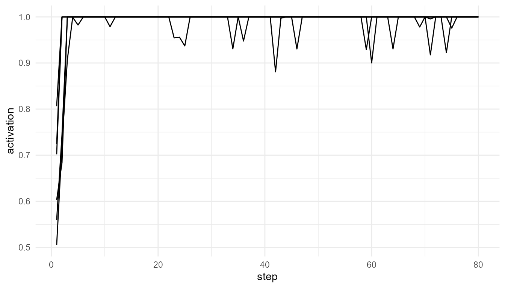

# What Is Consciousness?

``` r
library(consciousnessModelR)
```

## Purpose

This article introduces the conceptual foundation of
`consciousnessModelR`. The package is not designed to solve the problem
of consciousness, nor does it attempt to measure or create
consciousness. Instead, it provides simplified computational models that
help learners examine how different theories describe attention, access,
integration, broadcast, and threshold-like transitions.

The guiding question is not whether these simulations are conscious.
They are not. The guiding question is:

> What kinds of mechanisms do different theories emphasize when they
> attempt to explain conscious access, awareness-like processing, or the
> organization of conscious cognition?

This distinction is important. A computational model can represent
selected structural or functional features of a theory without
reproducing the phenomenon that the theory ultimately aims to explain.

## Consciousness as a multi-dimensional concept

The term *consciousness* does not refer to a single, simple property. In
philosophy, psychology, neuroscience, and cognitive science, it is used
in several related but distinct ways. It may refer to subjective
experience, wakefulness, reportability, perceptual awareness,
self-awareness, attention, or the availability of information for
reasoning and action.

One influential distinction is between **phenomenal consciousness** and
**access consciousness** (Block 1995). Phenomenal consciousness refers
to the qualitative, first-person character of experience: what it is
like to see red, feel pain, hear music, or experience a thought. Access
consciousness refers to the availability of information for reasoning,
memory, decision-making, verbal report, or behavioral control.

This distinction helps clarify the scope of the package. The functions
in `consciousnessModelR` are primarily concerned with access-oriented
and process-oriented concepts. They model competition, priority,
integration, broadcast, and threshold crossing. They do not model
subjective feeling, first-person experience, or the qualitative
character of consciousness.

## The hard problem and the modeling problem

A major challenge in consciousness studies is the distinction between
explaining cognitive functions and explaining subjective experience.
Chalmers famously described this as the difference between the “easy
problems” and the “hard problem” of consciousness (Chalmers 1996). The
so-called easy problems are not easy in a practical scientific sense,
but they concern functions that can be studied through behavior,
cognition, and neural mechanisms: attention, report, discrimination,
memory, integration, and control.

The hard problem asks why and how physical or computational processes
are accompanied by subjective experience at all. A model may explain how
information is selected, integrated, or broadcast, but that does not
automatically explain why such processing should feel like anything from
the inside.

`consciousnessModelR` therefore focuses on the modeling problem rather
than claiming to solve the hard problem. It asks how theoretical ideas
can be represented in simplified computational form. This makes the
package useful for education, comparison, and conceptual analysis, while
preserving the distinction between functional simulation and subjective
consciousness.

## Consciousness, attention, and access

Attention and consciousness are closely related, but they are not
identical. Attention can be understood as a process that prioritizes
certain signals for further processing. Conscious access, by contrast,
often refers to information becoming available to broader cognitive
systems such as working memory, report, planning, or action.

Some theories treat attention as an important gateway to consciousness.
Others argue that attention and consciousness can dissociate. For
example, a stimulus may influence behavior without being consciously
reported, or a conscious experience may occur without focused attention.
This makes attention a useful but incomplete entry point into the study
of consciousness.

In `consciousnessModelR`, this distinction is reflected in the
separation between:

- [`attention_competition_model()`](https://noushinn.github.io/consciousnessModelR/reference/attention_competition_model.md),
  which models priority-based selection;
- [`simulate_global_workspace()`](https://noushinn.github.io/consciousnessModelR/reference/simulate_global_workspace.md),
  which models competition and possible global access;
- [`broadcast_network()`](https://noushinn.github.io/consciousnessModelR/reference/broadcast_network.md),
  which models the spread of selected information through a system;
- [`consciousness_threshold()`](https://noushinn.github.io/consciousnessModelR/reference/consciousness_threshold.md),
  which applies a simplified access threshold.

The separation of these functions is intentional. It allows learners to
examine attention, access, broadcast, and threshold crossing as related
but distinct processes.

## Major theoretical approaches represented in the package

The package is organized around several broad theoretical ideas.

**Global Workspace Theory** proposes that conscious access involves
information becoming globally available to multiple specialized systems
(Baars 1988; Dehaene 2014). In this view, many processes operate locally
and unconsciously, but a selected signal may become widely available
through a global workspace.

**Attention and competition models** emphasize the selection of
information from among competing signals. Selection may depend on
salience, novelty, task relevance, or noise. These models help explain
why some information receives priority while other information remains
in the background.

**Broadcast models** emphasize the distribution of selected information
across a network. Information that remains local may have limited
influence, while broadcast information can affect memory,
decision-making, report, and action.

**Information integration approaches** emphasize the organization of the
system itself. Integrated Information Theory, for example, argues that
consciousness is related to the degree to which a system is both
integrated and differentiated (Tononi 2004; Oizumi, Albantakis, and
Tononi 2014). The package does not compute formal phi, but it provides a
simplified educational proxy for thinking about integration and
differentiation.

**Threshold models** represent conscious access as a transition. Below a
threshold, information may remain weak, local, or unavailable for
report. Above a threshold, information may become stable, accessible, or
globally available. This is a simplified way to explore how continuous
activation can be treated as producing discrete access-like events.

## Package functions in conceptual context

| Function | Conceptual role | Theoretical emphasis |
|----|----|----|
| [`simulate_global_workspace()`](https://noushinn.github.io/consciousnessModelR/reference/simulate_global_workspace.md) | Models competition among processes and possible global access | Global Workspace Theory |
| [`attention_competition_model()`](https://noushinn.github.io/consciousnessModelR/reference/attention_competition_model.md) | Models how signals compete for priority | Attention and selection |
| [`broadcast_network()`](https://noushinn.github.io/consciousnessModelR/reference/broadcast_network.md) | Models the spread of selected information across a network | Broadcast and access |
| [`simulate_information_integration()`](https://noushinn.github.io/consciousnessModelR/reference/simulate_information_integration.md) | Models a simplified relationship between connectivity, shared activity, and differentiation | Information integration |
| [`consciousness_threshold()`](https://noushinn.github.io/consciousnessModelR/reference/consciousness_threshold.md) | Models threshold crossing as an educational proxy for awareness-like access | Threshold models |
| [`plot_consciousness_sim()`](https://noushinn.github.io/consciousnessModelR/reference/plot_consciousness_sim.md) | Visualizes simulation outputs | Interpretation and teaching |

This structure allows the package to represent consciousness theories as
modular educational models. Rather than treating consciousness as a
single number, the package separates it into interacting conceptual
dimensions.

## A minimal example

The following example simulates a simplified global workspace. Several
processes compete for activation. If one process becomes sufficiently
strong, it may cross an ignition threshold and be treated as globally
available.

``` r
sim <- simulate_global_workspace(
  n_processes = 6,
  steps = 80,
  ignition_threshold = 0.75,
  seed = 1
)

head(sim)
#>   step process activation winner is_winner broadcast ignited
#> 1    1      P1  0.5591961     P6     FALSE 0.0000000    TRUE
#> 2    1      P2  0.6028345     P6     FALSE 0.0000000    TRUE
#> 3    1      P3  0.7019484     P6     FALSE 0.0000000    TRUE
#> 4    1      P4  0.7242716     P6     FALSE 0.0000000    TRUE
#> 5    1      P5  0.5051432     P6     FALSE 0.0000000    TRUE
#> 6    1      P6  0.8062672     P6      TRUE 0.8062672    TRUE
```

``` r
plot_consciousness_sim(
  sim,
  x = "step",
  y = "activation",
  group = "process"
)
```



## Interpretation

The plot shows several processes fluctuating in activation. In a
global-workspace interpretation, local activation is not enough for
conscious access. A process must become strong enough to dominate
competition and cross a threshold for global availability.

This example illustrates a functional transition from local processing
to access-like broadcast. However, it should not be interpreted as a
model of subjective experience. The simulation represents a theoretical
mechanism, not consciousness itself.

## Why simplified models are useful

Simplified models are valuable because they make theoretical assumptions
visible. A verbal theory may describe attention, integration, broadcast,
or threshold crossing in general terms. A simulation requires these
ideas to be expressed as variables, rules, and outputs.

This forces several useful questions:

- What is being treated as the key mechanism?
- What is the model assuming?
- What is excluded?
- What changes when a parameter changes?
- Does the model represent access, experience, report, or only
  activation?

For teaching, these questions are often more important than the
numerical output itself. The model becomes a tool for conceptual
clarification.

## Limits of the package

The package should be interpreted carefully. It does not:

- measure consciousness;
- detect awareness;
- simulate subjective experience;
- determine whether biological or artificial systems are conscious;
- implement full neuroscientific models;
- solve the hard problem of consciousness.

Instead, it provides educational simulations that represent selected
ideas from consciousness theory. Its value lies in helping learners
compare theoretical structures and understand how abstract ideas can be
translated into computational form.

## Key takeaway

Consciousness is not a single variable that can be directly simulated in
a simple package. It is a multi-dimensional concept involving
experience, access, attention, integration, reportability, and
self-relation. `consciousnessModelR` focuses on the functional and
theoretical dimensions that can be represented through simplified
models.

The purpose of the package is therefore not to explain consciousness
completely, but to support careful thinking about how different theories
frame the problem.

## References

Baars, Bernard J. 1988. *A Cognitive Theory of Consciousness*. Cambridge
University Press.

Block, Ned. 1995. “On a Confusion about a Function of Consciousness.”
*Behavioral and Brain Sciences* 18 (2): 227–47.

Chalmers, David J. 1996. *The Conscious Mind*. Oxford University Press.

Dehaene, Stanislas. 2014. *Consciousness and the Brain*. Viking.

Oizumi, Masafumi, Larissa Albantakis, and Giulio Tononi. 2014. “From the
Phenomenology to the Mechanisms of Consciousness: Integrated Information
Theory 3.0.” *PLoS Computational Biology* 10 (5): e1003588.

Tononi, Giulio. 2004. “An Information Integration Theory of
Consciousness.” *BMC Neuroscience* 5 (42).
